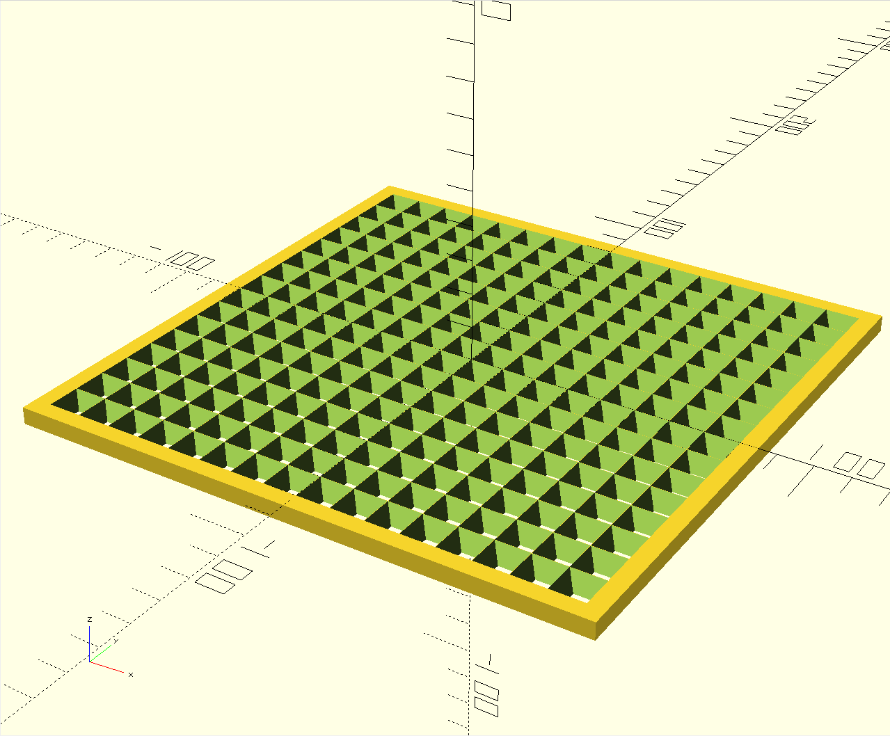

# WS2812 led matrix panel with ESP8266 controller.

## Used libs

- [FastLED](https://github.com/FastLED/FastLED) to send the values to the WS2812 LEDs. The XY support is based on one of the examples.
- [WiFiManager](https://github.com/tzapu/WiFiManager) to make it easy to connect it to the wifi.

## Protocol

The ESP reads 16x16x3 bytes in a single UDP packet on port 5060, and sets all the pixels to the byte values.

## Commands

### Set all to black

```bash
head -c 768 /dev/zero | socat -t 0 - UDP:192.168.2.35:5060
```

### Set to random colors

```bash
head -c 768 /dev/urandom | socat -t 0 - UDP:192.168.2.35:5060
```

### Send an image, cropped square and resized to 16x16.

```bash
convert image.png -background black -resize 16x16^ -gravity center -extent 16x16 RGB:- | socat -t 0 - UDP:192.168.2.35:5060
```

```bash
ffmpeg \
    -re \
    -i sample.mkv -vf "crop=in_h:in_h,scale=16:16,eq=brightness=-0.2" \
    -vcodec rawvideo \
    -pix_fmt rgb24 \
    -f rawvideo \
    -r 30 \
    udp://192.168.2.35:5060
```

## 3D-printable matrix

